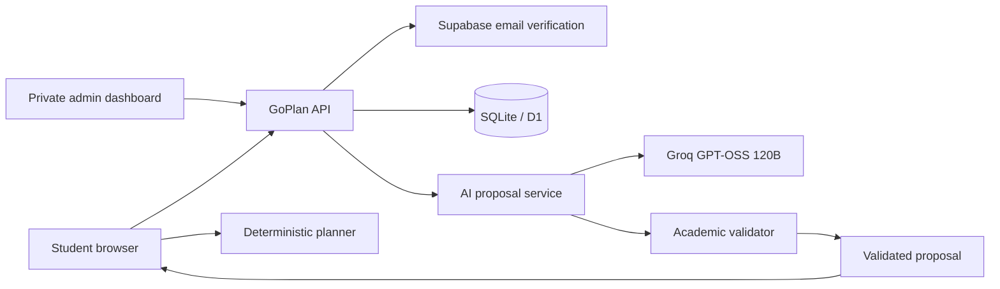

# Architecture

## Recommendation boundary

The model proposes decisions; it does not write directly to a student's saved roadmap. Academic choices are bounded by the reviewed dataset and checked after generation. The scheduler computes semester placement using prerequisites, credit caps and recorded progress. A changed roadmap is previewed before acceptance. Bounded retries repair rejected proposals; network failure does not silently produce fabricated advice.

## Workspace boundary

A workspace contains the six-step journey, saved and draft plans, progress and a small revision history. The server derives the owner from its authenticated session. Updates include an expected revision; a stale revision returns a conflict rather than overwriting newer work. Browser recovery copies are keyed by the verified account and workspace. They are not the authoritative cross-device store.

## Authentication boundary

A same-origin request asks Supabase to send an email code. GoPlan verifies the submitted code with Supabase, checks the confirmed email, and issues a five-minute HttpOnly setup cookie. A hashed, single-use database ticket gates password creation through Supabase. Normal sign-in uses Supabase password authentication; GoPlan then creates a random 256-bit session. Password resets revoke existing GoPlan sessions. Passwords and provider refresh tokens are never stored by GoPlan. Only a hash is stored in the database; the browser receives an HttpOnly, SameSite=Lax cookie with Secure enabled on HTTPS. Sessions expire after 30 days and are revoked on sign-out or GoPlan-data deletion. Temporary hashed rate-limit buckets bound email sends and verification attempts.

Legacy profiles are reconnected only after the same email is verified, and only when exactly one matching profile exists. The client cannot select another owner ID. The administrative allowlist is environment configuration, not frontend code. ChatGPT identity headers are not trusted by the new authentication path.

## Feedback and analytics

Reports are separate from identity-linked workspaces. Report receipts authorize a user's later withdrawal; they remain in the originating browser. A reviewer checks evidence, and only opted-in verified corrections enter later advice context. Daily operation counters contain no questionnaire, grade or plan payload. The student directory is separate from these counters and does not expose roadmap content.

## Portability

The HTTP handlers use Fetch API requests/responses and a small D1-style database interface. Development uses Node SQLite; the production builder embeds static assets in a Workers-compatible module. Hosting-specific deployment metadata is excluded from the public export. AI, auth and email services are runtime dependencies, not dependencies on the development assistant.
